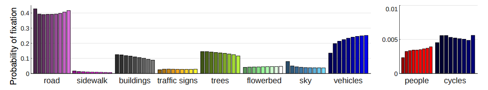

# Predicting the Driver’s Focus of Attention: the DR(eye)VE Project

## Supplementary Material

Collection of resources useful for the comprehension of the paper.

### Model predictions showcase (on test set)

A showcase of model predictions on the DR(eye)VE test set can be found here. The network learnt to reproduce the human driver focus of attention (FoA) in a variety of driving scenarios. Failure cases are also included and are shown towards the end of the video.

### How was Fig.8 made?
Sec 3.1 of the paper investigates on what human fixations focus on 
while driving, in terms of semantic classes. As explained in the paper,
this analysis has been carried out by normalizing the fixation map
so the maximum value equals one and then thresholding it at nine
different values ([0.00, 0.12, 0.25, 0.37, 0.50, 0.62, 0.75, 0.87, 1.00])
obtaining nine binary maps. As the threshold increases, the corresponding
binary map tightens around the fixation point, excluding from the 
analysis pixels far from them.
The following animation shows the original image (top-left), the segmented
image (top-right), binary maps at increasing thresholds (bottom-left) and 
pixel labels accounted for the construction of the histogram of each threshold.

 
Then, from accumulated class occurrences for each threshold we build a 
histogram, that is represented by Fig.8.

In this figure, by isolating the leftmost bar for each class, we obtain 
the histogram relative to the first threshold. By isolating the second one from 
left, we obtain the histogram relative to the second threshold.
Objects exibiting upward trends (e.g. road, vehicles, pedestrians) indicate that
when assigned to a non-zero probability of fixation, they are likely to be
the actual focus of the fixation point, whereas a downward trend indicates
an awareness of the object which is only circumstantial.

### Link to the paper: 

 <table>
  <tr>
  <td align="center"></td>
  </tr>
  <tr>
  <td><pre>  @article{palazzi2018predicting,
  title={Predicting the Driver's Focus of Attention: the DR (eye) VE Project},
  author={Palazzi, Andrea and Abati, Davide and Solera, Francesco and Cucchiara, Rita},
  journal={IEEE transactions on pattern analysis and machine intelligence},
  volume={41},
  number={7},
  pages={1720--1733},
  year={2018},
  publisher={IEEE}
}</pre></td>
  </tr>
</table> 

### Link to the DR(eye)VE Dataset

The DR(eye)VE dataset, containing 555'000 frames (approx. 6 hours) annotated with human driver gaze in different driving scenarios, can be freely downloaded at the following link: http://imagelab.ing.unimore.it/dreyeve
